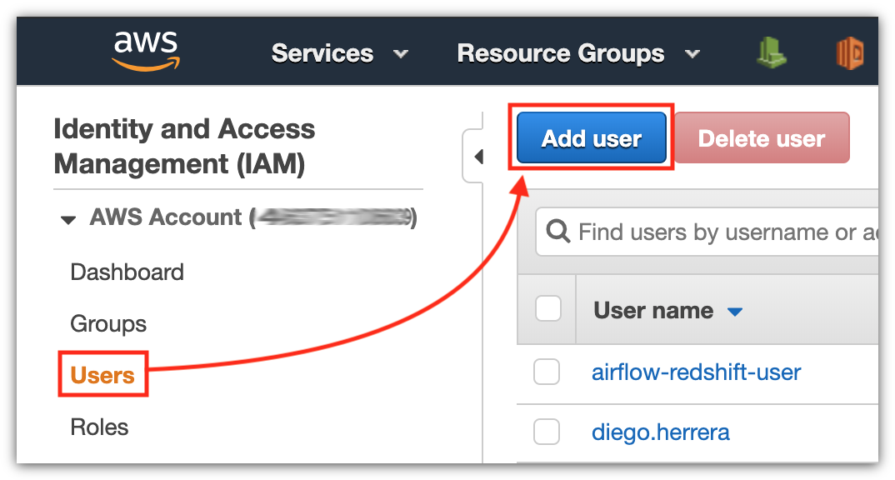

# Project: Data Pipelines with Airflow

A music streaming company, Sparkify, has decided that it is time to introduce more automation and monitoring to their data warehouse ETL pipelines and come to the conclusion that the best tool to achieve this is Apache Airflow.

They have decided to bring you into the project and expect you to create high grade data pipelines that are dynamic and built from reusable tasks, can be monitored, and allow easy backfills. They have also noted that the data quality plays a big part when analyses are executed on top the data warehouse and want to run tests against their datasets after the ETL steps have been executed to catch any discrepancies in the datasets.

The source data resides in S3 and needs to be processed in Sparkify's data warehouse in Amazon Redshift. The source datasets consist of JSON logs that tell about user activity in the application and JSON metadata about the songs the users listen to.

## Table of contents

- [Structure](#structure)
- [Requirements](#requirements)
  - [Preparing AWS](#preparing-aws)
    - [Creating an administrator user](#creating-an-administrator)
    - [Default VPC](#default-vpc)
    - [Security group rules](#security-group-rules)
  - [Cloning the repository](#cloning-the-repository)
  - [Creating the virtual environment](#creating-the-virtual-environment)
  - [Creating the Sparkify stack](#creating-the-sparkify-stack)
- [How to use](#how-to-use)
  - [Running Apache Airflow](#running-apache-airflow)
  - [Configuring connections](#configuring-connections)
  - [Configuring variables](#configuring-variables)
  - [Running the Sparkify DAG](#running-the-sparkify-dag)
  - [Cleaning the environment](#cleaning-the-environment)

---

## Structure<a name="structure"></a>

This tree shows the repository structure. Only the project's main files are described.

```
.
├── images
│   ├── airflow-connections-01.png
│   ├── airflow-connections-02.png
│   ├── airflow-dag-01.png
│   ├── airflow-dag-02.png
│   ├── airflow-dag-03.png
│   ├── airflow-dag-04.png
│   ├── airflow-variables-01.png
│   ├── airflow-variables-02.png
│   ├── create-stack.png
│   ├── default-vpc-01.png
│   ├── default-vpc-02.png
│   ├── user-01.png
│   ├── user-02.png
│   ├── user-03.png
│   └── user-04.png
├── src
│   ├── airflow
│   │   ├── dags
│   │   │   └── sparkify.py              # The Sparkify DAG
│   │   └── plugins
│   │       ├── helpers
│   │       │   ├── __init__.py
│   │       │   └── sql_queries.py       # Queries used by the custom operators
│   │       │── operators
│   │       │   ├── __init__.py
│   │       │   ├── data_quality.py      # Custom data quality operator
│   │       │   ├── load_dimensions.py   # Custom operator to populate dimension tables
│   │       │   ├── load_fact.py         # Custom operator to populate fact tables
│   │       │   └── stage_redshift.py    # Custom operator to populate stage tables
│   │       └── __init__.py
│   └── aws
│       ├── create_stack.py              # Script for the Sparkify stack creation
│       ├── delete_stack.py              # Script for the Sparkify stack deletion
│       ├── queries.py                   # Database creation queries
│       ├── sparkify_stack.json          # CloudFormation template of the Sparkify stack
│       └── sparkify.cfg                 # Application config file
├── .editorconfig
├── .gitignore
├── docker-compose.yml                   # Descriptor for the Sparkify DAG deployment
└── README.md
```

---

## Requirements<a name="requirements"></a>

It is assumed that the tools below are properly installed locally:

- [Python](https://www.python.org/) is a programming language that lets you work quickly and integrate systems more effectively. Versión 3.x is required.
- [pip](https://pip.pypa.io/en/stable/) is the package installer for Python.
- [Virtualenv](https://virtualenv.pypa.io/en/latest/) is a tool to create isolated Python environments.
- [Amazon Web Services](https://aws.amazon.com/) is the world's most comprehensive and broadly adopted cloud platform, offering over 165 fully featured services from data centers globally.
- [Docker Engine / Desktop](https://hub.docker.com/search/?type=edition&offering=community) powers millions of applications worldwide, providing a standardized packaging format for diverse applications.

### Preparing AWS<a name="preparing-aws"></a>

Before running the pipeline, we must tune up some things in our AWS account.

#### Creating an administrator user<a name="creating-an-administrator"></a>

**NOTE:** this step is necessary only if you don't have a user with privileges to manage AWS resources from the SDK.

Open the AWS console, log into your account and go to [IAM](https://console.aws.amazon.com/iam/home#/users). Choose _User_ from the left side menu, and then click the button _Add user_.



Fill in the _User name_ box. Also mark the _Programmatic access_ checkbox.


Now we must attach the policy `AdministratorAccess` to the user. Just select the option _Attach existing policies directly_, and then mark the policy's checkbox, down in the policies list.


And lastly, once the user is created, download its credentials clicking the button _Download .csv_. You can also copy the _Access key ID_ and the _Secret access key_ directly from the site and put them in a safe place. *Important:* never share this credentials to anyone, your AWS account can be compromised.


Have the user credentials on hand, we will use later. **NOTE:** you can use the credentials of any user having the proper permissions.

#### Default VPC<a name="default-vpc"></a>

**NOTE:** you can skip this step if you have not deleted the Default VPC.

We are provisioning resources that depends on the Default VPC. When an AWS account is created, it is given with a Default VPC already created, but maybe you deleted it. In that case, we must bring it back. Go to the [VPC](https://us-west-2.console.aws.amazon.com/vpc/home) service in the AWS console, click the button _Actions_ and then select the option _Create Default VPC_.


You can read [Default VPC and Default Subnets](https://docs.aws.amazon.com/vpc/latest/userguide/default-vpc.html) for more details.

#### Security group rules<a name="security-group-rules"></a>

We must create an inbound rule in our Security Group in order to connect Redshift from internet. This can be done in the [Security Group](https://us-west-2.console.aws.amazon.com/vpc/home#SecurityGroups) menu within the VPC service. Remember we are using the Default VPC, so do we with the Security Group: select the Security Group created by the Default VPC, and then the tab _Inbound Rules_.

Click the button _Edit rules_ and create a new one as follows:

- **Type**: Custom TCP
- **Protocol**: TCP
- **Port Range**: 5439
- **Source**: Custom
- **CIDR**: 0.0.0.0/0


### Cloning the repository<a name="cloning-the-repository"></a>

The first step is to clone this repository. Just type the following command in your Terminal:

```bash
# Clone the repository...
git clone https://github.com/vermicida/data-pipelines.git

# ...and move to its directory
cd data-pipelines
```

### Creating the virtual environment<a name="creating-the-virtual-environment"></a>

Once the project is cloned, you must create a new virtual environment for it. You may have multiple Python versions installed, so it's important to specify the correct one with the `--python` argument. The code on this repository has been successfully tested over Python 3.6, but it must work on any Python 3 version; set the version that applies to your case in the following commands:

```bash
# Create the virtual environment...
virtualenv --python python3.6 project-env

# ...and activate it
source project-env/bin/activate
```

It's time to install the project's dependencies. You will use `pip` to do this job:

```bash
pip install -r requirements.txt
```

It will be ready in a minute.

### Creating the Sparkify stack<a name="creating-the-sparkify-stack"></a>

The Sparkify stack will create the following resources:

- A [AWS Redshift](https://aws.amazon.com/redshift/) cluster that we will use as data warehouse
- A [IAM](https://aws.amazon.com/iam/) role to access to S3 in a properly way

Go to the file `src/aws/sparkify.cfg` and paste the credentials you get [before](#creating-an-administrator) in the following keys:

```ini
...
ACCESS_KEY_ID = the-access-key-id
SECRET_ACCESS_KEY = the-secret-access-key
...
```

Go back to your Terminal and run the following script:

```bash
# Move to the directory src/aws...
cd src/aws

# ...and run the script to create the stack
python create_stack.py
```

This action takes ~5 minutes. Once it's finished, you will see a summary like this:


Keep it safe, you will need it in a minute to configure Apache Airflow.

---

## How to use<a name="how-to-use"></a>

Here are listed the steps to follow in order to make the pipeline work.

### Running Apache Airflow<a name="running-apache-airflow"></a>

We lean on Docker to run Apache Airflow. In the root directory of the project you will find the file `docker-compose.yml`: that's the one that make magic happens! It creates a container topology:

- A container running Apache Airflow with a [LocalExecutor](https://www.astronomer.io/guides/airflow-executors-explained/)
- A container running PostgreSQL as the Apache Airflow's [Database Backend](https://airflow.readthedocs.io/en/stable/howto/initialize-database.html)

Also, it mounts the directories `src/airflow/dags` and `src/airflow/plugins` in the Apache Airflow container to be able to work with our Sparkify DAG.

Let's do it!

```bash
# Move to the root directory...
cd ../..

# ...and start the containers
docker-compose up
```

Don't panic if you see some errors like this, we will fix it in a minute:

```bash
KeyError: 'Variable sparkify_config does not exist'
```

Open your browser and navigates to `http://localhost:8080`: Apache Airflow is running now!

### Configuring connections<a name="configuring-connections"></a>

Remember when we created the Sparkify stack [before](#creating-the-sparkify-stack)? Get back the summary info. In the Apache Airflow console, go to the menu _Admin_ and select _Connections_:


Create a new one using the given values. It will be used to connect to the Redshift cluster we created earlier.


Click _Save_. Done!

### Configuring variables<a name="configuring-variables"></a>

Again in the menu _Admin_, but select _Variables_ this time:


Create a new variable using `sparkify_config` as _Key_ and the JSON object below as _Val_. **Important:** copy the IAM role ARN given in the stack creation summary and paste it as the value of the key `iam.role_arn` (replace the dummy text `iam-role-arn-here`).

```json
{
    "dag": {
        "retries": 3,
        "retry_delay": 5
    },
    "iam": {
        "role_arn": "iam-role-arn-here"
    },
    "s3": {
        "log_data": "s3://udacity-dend/log-data",
        "log_data_json_path": "s3://udacity-dend/log_json_path.json",
        "song_data": "s3://udacity-dend/song-data"
    },
    "redshift": {
        "staging_events_table": "staging_events",
        "staging_songs_table": "staging_songs",
        "artists_dimension": "artists",
        "artists_table": "artists",
        "songs_table": "songs",
        "songplays_table": "songplays",
        "users_table": "users",
        "time_table": "time"
    }
}
```


Click _Save_. Now, the errors shown before have gone!

### Running the Sparkify DAG<a name="running-the-sparkify-dag"></a>

You can go to the DAGs menu and see the Sparkify DAG now listed:


Turn _On_ the switch next to the DAG name to make the Apache Airflow scheduler run the defined tasks.


You can navigate the DAG details by clicking in its name. The _Graph view_ shows a diagram on how the tasks are going to be executed:


You can also check how the Apache Airflow scheduler is doing with the DAG tasks on the _Tree view_ tab. Dark green means good!


### Cleaning the environment<a name="cleaning-the-environment"></a>

Once the DAG has been executed, and you checked it did well, you can clean the environment this way.

First, stop the Apache Airflow containers with `Ctrl + C`. When the process stops, run this command:

```bash
docker-compose down
```

It will delete all the resources created to run Apache Airflow (containers, networks, etc).

Now, it's time to delete the Sparkify stack created in AWS:

```bash
# Move to the directory src/aws...
cd src/aws

# ...and run the script to delete the stack
python delete_stack.py
```

And that's it :-)
